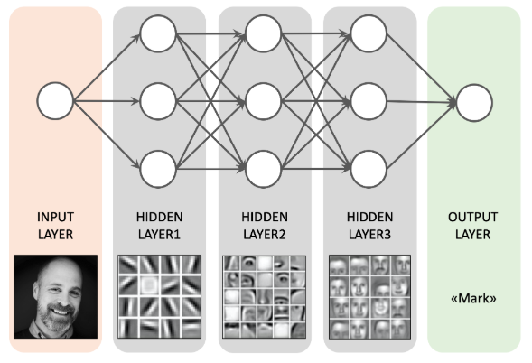

# Crítica: *Zhang, S., Yao, L., Sun, A., & Tay, Y. (2019). Deep learning based recommender system: A survey and new perspectives.*

El objetivo del texto es presentar una revisión bibliográfica de los avances en los sistemas de recomendación basados en *deep learning*. En las secciones 3 y 4 presentan los desfíos y los problemas abiertos en el área, identifican las nuevas tendencias y posibles direcciones en las investigaciones futuras sobre generar recomendaciones con *deep learning*. A continuación, comentaré aspectos que considero interesantes y las dudas que tuve luego de leer el texto.

Primero, es interesante que en *session-based recomendation without user identifier* se hayan obtenido resultados similares con GRU4Rec y un simple *approach* basado en vecindad. Esto muestra que los mecanismos que no están basados en *deep learning* también son competitivos y son una alternativa. Asimismo, señalan que un ensamble entre los modelos obtuvo un mejor rendimiento. Por lo que, hay que tener en consideración mezclar metodologías (vía regresión lineal, boosting, bagging, etc) con *deep learning* y de filtrado más clásico. 

Segundo, los autores desmienten que las recomendaciones con *deep learning* carecen completamente de explicabilidad. Especialmente, recalcan que los *attentional models* son interpretables en gran medida porque entregan *insights* de cómo están funcionando. Asimismo, según West (2019) el conocimiento de cada capa de la red se construye sobre el conocimiento de las anteriores. Por ejemplo, en la siguiente red de tres capas se ve que en cada una agrega y recombina el conocimiento de las aprendidas:

Referencias:

* West, M. (2019). *An Introduction to Deep Learning*. Recuperado de 
https://www.bouvet.no/bouvet-deler/an-introduction-to-deep-learning